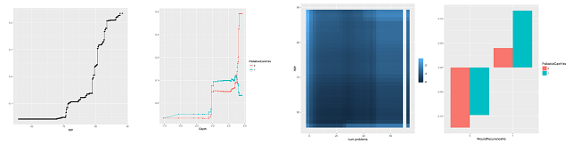

# Interpretable Models (GAM and GA2M) - Instructions

-------
-------


# Machine Learning Tool Kit

MLTK is a Java package of various supervised machine learning algorithms developed by [Yin Lou](https://github.com/yinlou/mltk).  
The GAM sub-module is in the directory `src/mltk/predictor/gam`. It provides a collection of tools to learn *intelligible models* (GAM or GA2M), test them, and visualize them. Those are particularly interesting since they often seem to perform as well as complex model such as random forests, but are easily interpretable thanks to their additive structure, only depending on single variable or interaction terms.  

This sub-module was completed to provide automatic variable selections and additional visualizations (like ROC curves).


After downloading the package, you should compile the sources in a `bin` directory and add it to the java path with:
```
$ export CLASSPATH=/path/to/mltk/bin:$CLASSPATH
```


# Dependencies

- Java 7
- The following packages must be installed in R : `readr`, `dplyr`, `stringr`, `reshape2`, and `ggplot2`.

# Data Format

## Overview

Datasets should be provided in separate white-space-delimited text files without any headers. It supports continuous, nominal and binned attributes. All datasets should have the same number and order of columns. An additional file should be provided with the attributes' description as follow:

```
attribute_name: type [(class)]
```

The R script `format_data.R` in `utils/` was made to process a classic data file (with headers, raw values without continuous/discrete distinctions, ...) into the proper format to work with MLTK. In particular it removes bad characters in variables' name, and create the attribute file. Categorical variable coded as integer are detected when a variable takes all values in the range `[0, n_val]`.

## File naming

Default values were set to simplify the commands, although it is possible not to follow those and use additional arguments (in that case, refer to the documentation in the source files).
The defaults are :  

- `data_attr.txt` for the initial file with attributes' description, and `binned_attr.txt` after the data is discretized (see below)  

- `binned_train.txt`, `binned_val.txt` and `binned_test.txt` respectively for the training, validation, and test sets after discretization  

Additionally, we suppose the following directory organization:  
.src/ : all sources  
.bin/ : all binaries  
.utils/ : contains the R scripts  
.data/  
&nbsp;&nbsp;&nbsp;&nbsp;|.. myDataSet/ : the working directory for this dataset, which contains all data  


## Discretizing the data

Interaction detection and GA2M work with discretized data (continuous data are binned). So this is the first step before moving forward and training models.

This can be done with the set of commands :
```
$ java mltk.core.processor.Discretizer -t all.txt -m binned_attr.txt -i train.txt -o binned_train.txt

$ java mltk.core.processor.Discretizer -i val.txt -o binned_val.txt

$ java mltk.core.processor.Discretizer -i test.txt -o binned_test.txt
```

where `train`, `val`, `test` are the original data files (not binned), and `all` is the whole training data containing both `train` and `val`. 


```
Usage: mltk.core.Discretizer
-i     input dataset path
-o     output dataset path
[-r]   attribute file path
[-d]   discretized attribute file path
[-m]   output attribute file path
[-n]   maximum num of bins (default: 256)
[-t]   training file path
```


# Building Models

## Building GAM

### Training

```
Usage: mltk.predictor.gam.GAMLearner
-m	maximum number of iterations
[-t]	train set path
[-g]	task between classification (c) and regression (r) (default: r)
[-v]	validation set path
[-e]	evaluation metric (default: default metric of task)
[-r]	attribute file path
[-o]	output model path
[-V]	verbose (default: true)
[-b]	base learner (default: tr:3:100)
[-s]	seed of the random number generator (default: 0)
[-l]	learning rate (default: 0.01)
[-f]  path to the features info if feature selection (ex: featInfo.txt:N:500)
[-w]  path to save the selected features
```

You can adjust the number of boosting iterations (`-m`), the learning rate (`-l`) and the base learner (`-b`, where `tr:3:100` is a bagged tree with 3 maximum leaves and 100 bags), this will largely impact the runtime.

The file with *feature information* is typically the result of the `Diagnostics tool` (see below), and the argument must be formatted as follow: `filename:C:v`, where `C` is either `N` or `T`. With `N`, the `v` first variables are selected; with `T`, all the variables with importance greater than `v` are selected.  
If the argument `-w` is not null, the selected variables are written in a file; this is required to produce the plots.

Command example  

- without feature selection:  

```
$ java mltk.predictor.gam.GAMLearner -m 50 -l 0.01 -g c -e a -o gams/gam54
```

- with feature selection:  

```
$ java mltk.predictor.gam.GAMLearner -m 50 -l 0.01 -g c -e a -o gams/gam54 \
                                     -f diags/gam53.txt:N:10 -w feats/gam54
```
this will save the model in the file `gam54`.  

The possible evaluation metrics are : AUC (a), Error (c), RMSE (r).


## Testing

### Test

After building your model you can test it with the command: 
```
$ java mltk.predictor.evaluation.Evaluator -e a -m gams/gam54
```


### Diagnostics
The `Diagnostic` tool evaluates the importance of each variable in the model. This is useful to rank them and perform feature selection. This is done through the command:
```
$ java mltk.predictor.gam.tool.Diagnostics -i gams/gam54 -o diags/gam54.txt
```

### Residuals
To proceed with a GA2M model and to detect interactions, you need to compute and save the residuals of the GAM, with the command:

```
$ java mltk.predictor.evaluation.Predictor -g c -m gams/gam54 -R res/residual54.txt
```


## Building GA2M

### Interaction detection with the FAST algorithm

```
Usage: mltk.predictor.gam.interaction.FAST
-R	  residual path
-o	  output path
[-d]	dataset path
[-r]	attribute file path
[-b]	number of bins (default: 256)
[-p]	number of threads (default: 1)
```
All attributes needs to be binned, and residuals from the GAM must be computed and saved.  
The output is a list of triples, where the first two elements are indices of the attributes, and the third element is the residual sum of squares (RSS). Stronger pairwise interactions have lower RSS; and pairs are ranked by increasing RSS.

Use the following command to measure the strength of all pairs of interactions:
```
$ java mltk.predictor.gam.interaction.FAST -R res/residual54.txt -o ints/interactions54.txt
```

### Training

```
Usage: mltk.predictor.gam.GA2MLearner
-i	  input model path
-I	  list of pairwise interactions path
-m	  maximum number of iterations
[-t]	train set path
[-g]	task between classification (c) and regression (r) (default: r)
[-v]	valid set path
[-e]	evaluation metric (default: default metric of task)
[-r]	attribute file path
[-o]	output model path
[-V]	verbose (default: true)
[-b]	bagging iterations (default: 100)
[-s]	seed of the random number generator (default: 0)
[-l]	learning rate (default: 0.01)
[-p]  maximum number of pairs
[-f]  path to the features info if feature selection (ex: featInfo.txt:N:500)
```

The FAST algorithm will rank all $N^2$ interaction terms, but typically only a few of them are relevant, and it becomes intractable to use all of them if there are too many variables ($N \approx 1000$). In this case, we can use the argument `-p NumPairs` to select only the best `NumPairs` terms, according to FAST.

As with GAMs, you can interatively perform feature selection thanks to the diagnostics file of a wider GA2M, with the `-f` argument. Note that this selection only applies to interaction terms, and the `-p` argument should still be given (if used first) to avoid useless computations. Finally, there is no need to save the selected features in this case.

Example:  

- without variable selection:  

```
$ java mltk.predictor.gam.GA2MLearner -p 100 -m 100 -g c -e a -i gams/gam54 \
                                      -I ints/interactions54.txt -o ga2ms/ga2m54
```

- with feature selection:  

```
$ java mltk.predictor.gam.GA2MLearner -p 300 -m 100 -g c -e a -i gams/gam54 \
                                      -I ints/interactions54.txt -o ga2ms/ga2m541 \
                                      -f diags/ga2m54.txt:N:50
```

## Testing

### Test
```
$ java mltk.predictor.evaluation.Evaluator -e a -m ga2ms/ga2m54
```

### Diagnostics
```
$ java mltk.predictor.gam.tool.Diagnostics -i ga2ms/ga2m54 -o diags/ga2m54.txt
```


# Making Predictions

This can be done with the module `mltk.preidictor.evaluation.Predictor`.

```
Usage: Predictor
-m	  model path
[-d]	data set path (default : binned_train.txt)
[-r]	attribute file path
[-p]	prediction path
[-R]	residual path
[-g]	task between classification (c) and regression (r) (default: r)
[-P]	output probablity (default: false)
```

So to predict the class of each observation of a test set, we can use the command:
```
$ java mltk.predictor.evaluation.Predictor -g c -d binned_test.txt -m ga2ms/ga2m541 \
                                           -p class_prediction.txt
```

and if we would rather get the class probabilities:
```
$ java mltk.predictor.evaluation.Predictor -g c -d binned_test.txt -m ga2ms/ga2m541 \
                                           -p prob_prediction.txt -P true
```


# Visualization

## ROC curves

When testing with AUC, you can provide an additional argument `-o` specifying a file to save data to later create ROC and Precision-Recall curves:

```
$ java mltk.predictor.evaluation.Evaluator -e a -m ga2ms/ga2m54 -o curves/ga2m54
```

Then you can use the R script `utils/save_curves.R input_file output_file` to create the images:
```
$ Rscript ../../utils/save_curves.R curves/ga2m54 curves/g2m54
```

## Feature contribution

```
Usage: mltk.predictor.gam.tool.Visualizer
-i	 input model path
-o	 output directory path
[-r] attribute file path
[-d] dataset path
[-f] features path
[-s] Rscript directory (default : ../../utils)
```

If feature selection was used to build the GAM, then the feature file created with the `-w` argument must be present and given, so that only those features are used (otherwise empty plots will be created); the selected interactions terms do not have to be specified though.

To generate all the plots in the directory `plots/ga2m541/` use the command:
```
$ java mltk.predictor.gam.tool.Visualizer -i ga2ms/ga2m541 -o plots/ga2m541 -f feats/gam54
```

&nbsp;&nbsp;&nbsp;&nbsp;&nbsp;&nbsp;&nbsp;&nbsp;&nbsp;&nbsp;&nbsp;&nbsp;
&nbsp;&nbsp;&nbsp;&nbsp;&nbsp;&nbsp;&nbsp;&nbsp;&nbsp;&nbsp;&nbsp;&nbsp;
&nbsp;&nbsp;&nbsp;&nbsp;&nbsp;&nbsp;&nbsp; 


# Iterative GAM and GA2M with feature selection

I provide two bash scripts `sparse_gam.sh` and `sparse_ga2m.sh` to automatically build GAMs (or GA2Ms) with feature selection, for some given number of features, by using the diagnostics on the less sparse model already built.  
To run `sparse_gam.sh`, one only needs to have a complete GAM model generated, and to have computed the diagnostics. If it is saved in `gams/gam1`, then it suffices to change the script by setting the variable `ID0=1`, and to specify the number of features to consider at each step with `all_nfeats`.

Example:
```
ID0=1
all_nfeats=(500 300 100 50 10)
```
This will look for the base model in `gams/gam1` and the diagnostics in `diags/gam1.txt`, select the best 500 variables to create the model `gam10`, compute the new diagnostics, use them to select the best 300 variables to create `gam11`, compute the new diagnostics, use them to select the best 100 variables to create `gam12`, etc... 
For each, GAM, it will also compute a GA2M based on it, so that one can appreciate the quality of the selected variables once interactions are added.

It is better to save the output in a file, `$ ./sparse_gam.sh > logs/log1` for example, so that one can easily get the test results of each model with `$ grep "AUC\|GA\" logs/log1`. At each step, the first result is for the GAM and the second is for the GA2M.

The procedure to build sparse GA2M is exactly the same. If we found that `gam12` was a good trade-off for example, we can use it as the base GAM for a sparse GA2M by setting `ID0=12` in `sparse_ga2m.sh` and choose the number of interaction terms at each step. This will build the models `ga2m120`, `ga2m121`, `ga2m122`, ...  


# Reference

- [Accurate Intelligible Models with Pairwise Interactions.](http://www.cs.cornell.edu/~yinlou/papers/lou-kdd13.pdf)  
Yin Lou, Rich Caruana, Johannes Gehrke, and Giles Hooker.  
KDD'13, Chicago, IL, USA.

- [Intelligible Models for Classification and Regression](http://www.cs.cornell.edu/~yinlou/papers/lou-kdd12.pdf)  
Yin Lou, Rich Caruana, and Johannes Gehrke.  
KDD'12, Beijing, China.